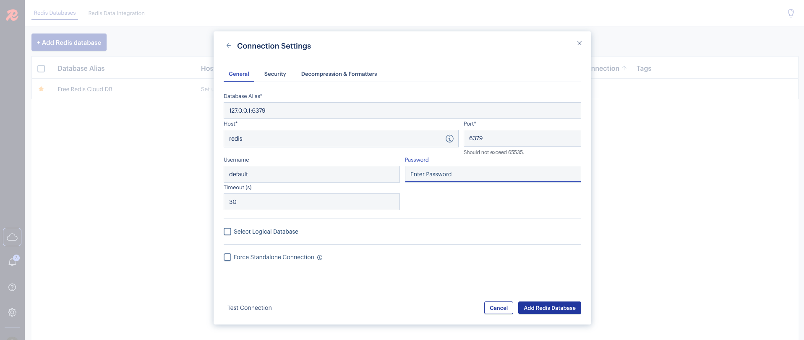

# REDIS database in local with REDIS Insight browser

## Start the server

Build the image

```sh
podman compose build .
```

Run the redis server in local.

```sh
podman compose up -d
```

## Open Redis insight

The database explorer insight will be expose in port 5540

Login to the redis insight. no user password needed.

[http://localhost:5540](http://localhost:5540)

## Create database connection

- host: redis
- username: default
- password: redpassword (defined in docker-compose file in environment variable)


