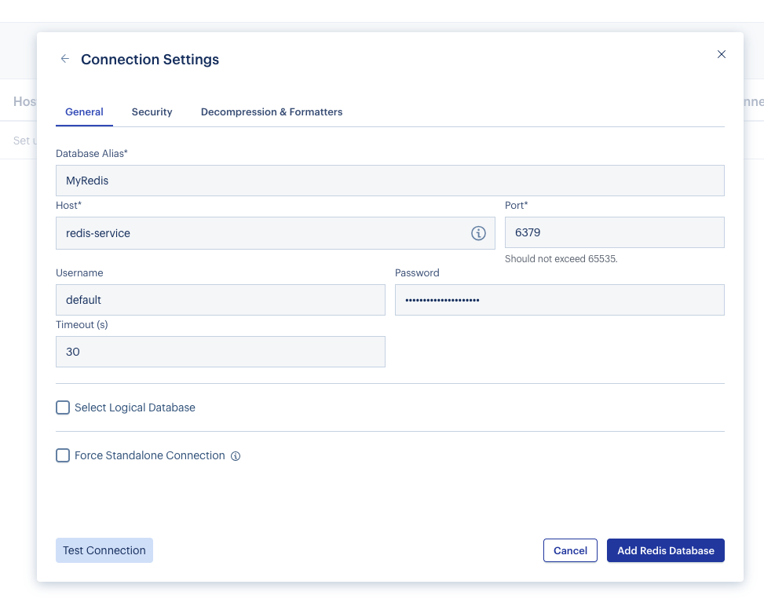

# REDIS Deployment in OpenShift Cluster

## 1 - Create configuration

Create a project to deploy all the kubernetes resources. If you choose a different name, make sure you update all the yaml configuration file before you apply them.

```sh
oc new-project redis-db
```

Create PersistentVolumeClaims for Redis

```yaml
cat <<EOF | oc apply -f -
apiVersion: v1
kind: PersistentVolumeClaim
metadata:
  name: redis-pvc
  namespace: redis-db
spec:
  accessModes:
    - ReadWriteOnce
  resources:
    requests:
      storage: 5Gi
EOF
```

Create PersistentVolumeClaims for Redis Insight

```yaml
cat <<EOF | oc apply -f -
apiVersion: v1
kind: PersistentVolumeClaim
metadata:
  name: redisinsight-pvc
  namespace: redis-db
spec:
  accessModes:
    - ReadWriteOnce
  resources:
    requests:
      storage: 1Gi
EOF
```

Create a secret for Redis login password. Choose a strong password for yourself.

```sh
oc create secret generic redis-password -n redis-db \
--from-literal=password=yourStrongPassword123
```

## Create deployment

Redis reployment

```yaml
cat <<EOF | oc apply -f -
apiVersion: apps/v1
kind: Deployment
metadata:
  name: redis
  namespace: redis-db
  labels:
    app: redis
spec:
  replicas: 1
  selector:
    matchLabels:
      app: redis
  template:
    metadata:
      labels:
        app: redis
    spec:
      containers:
      - name: redis
        image: redis:8.4.0-alpine
        env:
        - name: REDIS_PASSWORD
          valueFrom:
            secretKeyRef:
              name: redis-password
              key: password
        ports:
        - containerPort: 6379
          name: redis
        command:
          - sh
          - -c
          - |
            redis-server \
              --appendonly yes \
              --requirepass "$REDIS_PASSWORD" \
              --dir /data
        volumeMounts:
        - name: redis-data
          mountPath: /data
        resources:
          requests:
            memory: "256Mi"
            cpu: "250m"
          limits:
            memory: "512Mi"
            cpu: "500m"
        livenessProbe:
          tcpSocket:
            port: 6379
          initialDelaySeconds: 30
          periodSeconds: 10
        readinessProbe:
          exec:
            command:
            - redis-cli
            - ping
          initialDelaySeconds: 5
          periodSeconds: 5
      volumes:
      - name: redis-data
        persistentVolumeClaim:
          claimName: redis-pvc
EOF
```

Redis insight database browser deployment

```yaml
cat <<EOF | oc apply -f -
apiVersion: apps/v1
kind: Deployment
metadata:
  name: redisinsight
  namespace: redis-db
  labels:
    app: redisinsight
spec:
  replicas: 1
  selector:
    matchLabels:
      app: redisinsight
  template:
    metadata:
      labels:
        app: redisinsight
    spec:
      containers:
      - name: redisinsight
        image: redis/redisinsight:latest
        ports:
        - containerPort: 5540
          name: http
        volumeMounts:
        - name: redisinsight-data
          mountPath: /data
        resources:
          requests:
            memory: "256Mi"
            cpu: "100m"
          limits:
            memory: "512Mi"
            cpu: "500m"
      volumes:
      - name: redisinsight-data
        persistentVolumeClaim:
          claimName: redisinsight-pvc
EOF
```

## Create services to expose redis and redis insight.

```yaml
cat <<EOF | oc apply -f -
apiVersion: v1
kind: Service
metadata:
  name: redis-service
  namespace: redis-db
  labels:
    app: redis
spec:
  type: ClusterIP
  ports:
  - port: 6379
    targetPort: 6379
    protocol: TCP
    name: redis
  selector:
    app: redis
EOF
```

```yaml
cat <<EOF | oc apply -f -
apiVersion: v1
kind: Service
metadata:
  name: redisinsight-service
  namespace: redis-db
  labels:
    app: redisinsight
spec:
  type: ClusterIP
  ports:
  - port: 5540
    targetPort: 5540
    protocol: TCP
    name: http
  selector:
    app: redisinsight
EOF
```

## Expose redis insight browser using routes

```yaml
cat <<EOF | oc apply -f -
apiVersion: route.openshift.io/v1
kind: Route
metadata:
  name: redisinsight-route
  namespace: redis-db
spec:
  to:
    kind: Service
    name: redisinsight-service
  port:
    targetPort: http
  tls:
    termination: edge
    insecureEdgeTerminationPolicy: Redirect
EOF
```

## Test

Get the route:

```sh
oc get routes redisinsight-route -o jsonpath="https://{.spec.host}" 
```

Get redis password:

```sh
oc get secret redis-password  -o jsonpath='{.data.password}' | base64 -d
```

Create connection:


