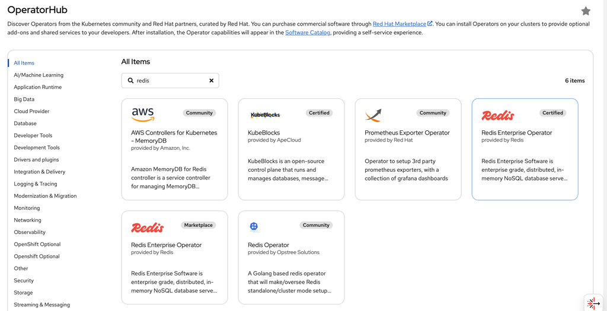

# Provision a Redis server in OpenShift Cluster using Operator

## Install the operator

1. Log in to OpenShift Web Console
    - Navigate to your OpenShift cluster console
2. Access OperatorHub
    - Go to Operators → OperatorHub
    - Search for "redis" in the search bar
    - Select Redis Enterprise Operator (certified) 8.0.2-2.9 provided by Redis
      
3. Install the Operator
    - Click Install
    - Configure installation settings:
        - Update Channel: Select the stable channel
        - Installed Namespace:  Create a namespace (e.g., redis-system)
        - Approval Strategy: Automatic or Manual
    - Click Install
4. Verify Installation
   - Navigate to Operators → Installed Operators
   - Check that Redis Cluster Operator shows status as "Succeeded"

***Verify installation via cli***

```sh
oc get csv
```

## Provision the Redis cluster

### Apply the below YAML file to provision a Redis cluster

```yaml
cat <<EOF | oc apply -f -
kind: RedisEnterpriseCluster
apiVersion: app.redislabs.com/v1
metadata:
  name: rec
  namespace: redis-system
spec:
  nodes: 1
  persistentSpec:
    enabled: true
    storageClassName: "ibmc-vpc-block-10iops-tier"  # Change to your storage class
    volumeSize: 10Gi
  redisEnterpriseNodeResources:
    limits:
      cpu: 2000m
      memory: 4Gi
    requests:
      cpu: 1000m
      memory: 2Gi
  uiServiceType: ClusterIP
  username: admin@example.com
  bootstrapperImageSpec:
    repository: registry.connect.redhat.com/redislabs/redis-enterprise-operator
  redisEnterpriseServicesRiggerImageSpec:
    repository: registry.connect.redhat.com/redislabs/services-manager
  redisEnterpriseImageSpec:
    repository: registry.connect.redhat.com/redislabs/redis-enterprise
  usageMeter:
    callHomeClient:
      imageSpec:
        repository: registry.connect.redhat.com/redislabs/call-home-client
EOF
```

### Create route to access the redis ui

```yaml
cat <<EOF | oc apply -f -
apiVersion: route.openshift.io/v1
kind: Route
metadata:
  name: rec-ui
spec:
  to:
    kind: Service
    name: rec-ui
  port:
    targetPort: 8443
  tls:
    termination: passthrough
    insecureEdgeTerminationPolicy: Redirect
EOF
```

get the password:

```sh
oc get secret rec  -o jsonpath='{.data.password}' | base64 -d
```

Get the url

```sh
oc get routes rec-ui -o jsonpath="https://{.spec.host}" 
```
